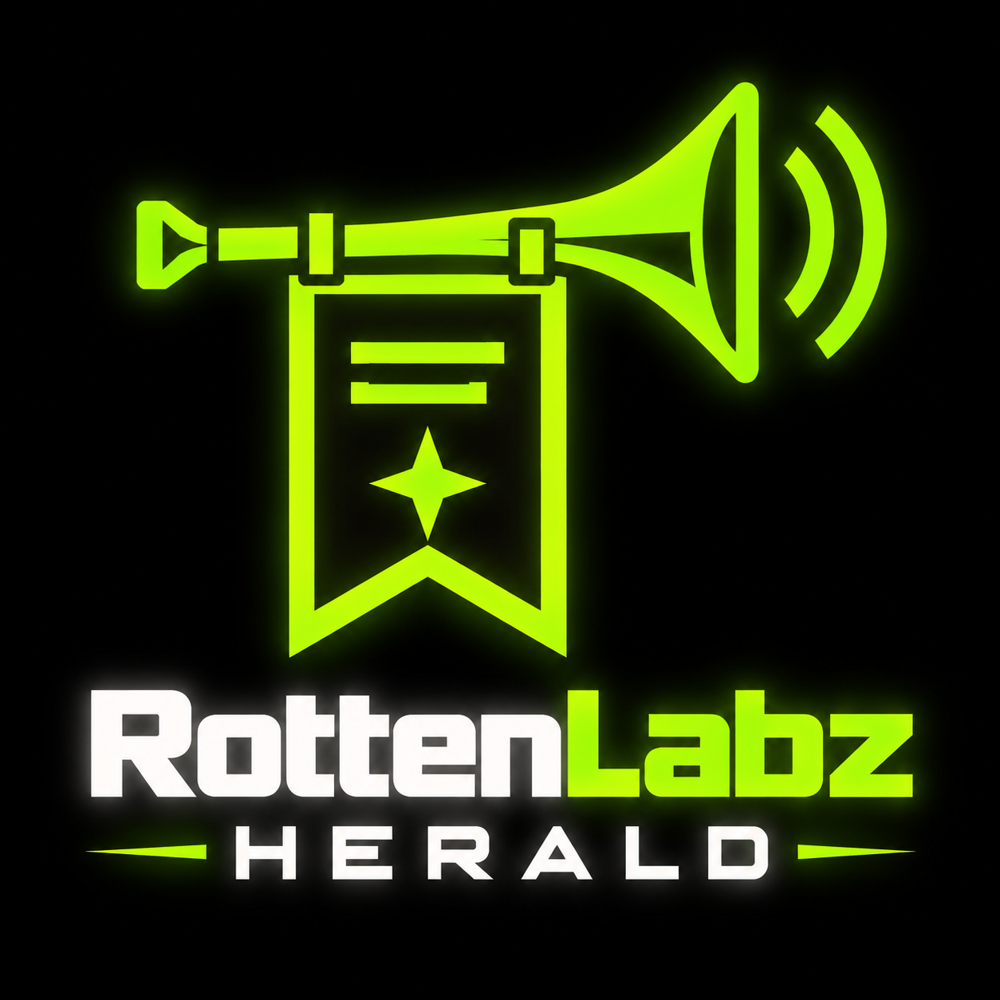

<p align="center">
  
</p>

# RottenLabz Herald

RottenLabz Herald is a self-hosted Discord announcement bot. The bot's everyday name is **Herald**. This tree contains the released **RottenLabz Herald v1.0.0** foundation and subsequent maintenance changes. Release work follows [RELEASE_CHECKLIST.md](RELEASE_CHECKLIST.md).

Herald discovers announcements, records them in SQLite, and sends them through a shared delivery queue. Each source chooses `automatic` delivery or owner `review`. Material revisions invalidate a review approval; durable claims prevent competing commands from sending the same item concurrently. A send with an unknown outcome becomes `uncertain` and needs deliberate owner resolution. Delivery is not guaranteed exactly once.

## Included features

- GamerPower free-game alerts, with a separate clickable attribution backlink and giveaway link.
- Configurable RSS/Atom sources with channel IDs, optional harmless subscription-role IDs, tags, attribution and per-source policy.
- Optional trusted local Python provider extensions, disabled until the operator configures them.
- `/herald` slash commands, ephemeral owner review controls, and owner DM recovery commands.
- Source-derived subscription menus, welcome messages, runtime diagnostics and a local hash-chain audit trail.
- Bounded provider retrieval and independent discovery/delivery scheduling.

GamerPower is the only bundled third-party content integration. Generic feed examples use placeholder URLs. Check each chosen source's terms before fetching, storing or republishing its material. Herald's MIT licence does not license third-party content.

## Release target and dependency evidence

The primary v1.0.0 deployment target is **Linux x86_64 with Python 3.12**. `RottenLabz_Herald_v1.0_Linux_Py312.lock.txt` is the exact hash-locked runtime qualified for that target; install it with `--require-hashes`. `requirements.txt` remains the direct-range manifest for development, review, and separately qualified platforms.

The v1.0.0 foundation was also regression-qualified on Windows 11 / Python 3.12 with real `discord.py`. On 14 September 2026 the pre-release foundation completed 185 tests on Windows (four expected platform skips), 185 tests on clean Linux with zero skips, and 185 tests again from the exact hash-locked Linux runtime. `pip check` passed, `pip-audit` reported no known vulnerabilities in both the exact runtime and public requirements at that time, and CycloneDX SBOMs were generated. Vulnerability results are time-sensitive and the final release-identity change must still repeat the final gates before publication.

## Start here

Use **Python 3.12**, Git, and a dedicated Discord application. Follow [installation](docs/INSTALL.md), then [configuration](docs/CONFIGURATION.md). The installation guide creates the private `.env` with mode `0600` **before** credentials are inserted. Newer Python versions or different platform closures must be qualified separately rather than assumed compatible.

Owner commands to begin with:

```text
/herald status
/herald doctor
/herald help
/herald queue review
```

Owner DM fallback:

```text
herald help
herald status
herald audit verify
```

Privileged commands always require `OWNER_ID`. Legacy server text commands are disabled by default. All server operations are scoped to the configured target guild.

## Operations and source exports

The hardened service layout separates root-owned application code under `/opt/rottenlabz-herald` from writable runtime state under `/var/lib/rottenlabz-herald`. A root-owned environment file under `/etc/rottenlabz-herald` supplies credentials. This is a proposed installation layout, not a claim about an existing deployment.

`backup-noenv.sh` exports **reviewed committed source only**. It requires a clean tracked tree and the explicit `approved-source-manifest.txt`, runs the built-in secret checks, then checks the exact complete manifest and every archive member against committed bytes. Tracked runtime/private material or a configured runtime path colliding with approved source causes failure. The single reviewed logo PNG is accepted only by its exact filename, format, size and SHA-256 identity. Untracked and uncommitted private changes are not included. This exporter is not a database or complete private deployment backup. See [security and export notes](docs/SECURITY.md).

Existing pre-v1 installations should be backed up and upgraded deliberately. Historical queue/audit data may require migration, and integrations removed from the public core are not automatically recreated.

## Project authority, licence and branding

**GitHub is authoritative** for development, issues, pull requests, tags and releases. **Codeberg is a source mirror only.** Operators manage remotes and disable duplicate collaboration surfaces separately. Final repository URLs and the later RottenLabz organisation transfer are operator decisions; none are assumed here.

Original software source and documentation use the [MIT licence](LICENSE), copyright 2026 RottenLabz. The RottenLabz Herald logo is separately reserved project branding; see [BRANDING.md](BRANDING.md). Also see [privacy](PRIVACY.md), [third-party notices](THIRD_PARTY_NOTICES.md), and [release history](CHANGELOG.md).

RottenLabz Herald is independently developed and is not affiliated with, sponsored by, or endorsed by Discord or GamerPower. Their names describe interoperability only.
